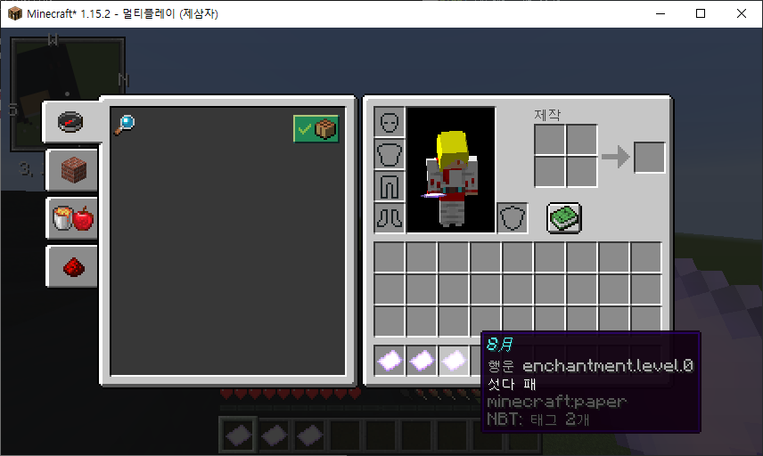

# Korean Poker
  > Update date : 2020 / 5 / 5

## 용도
  > 마인크래프트 미니게임용 플러그인

## 기능
  - 인게임에서 섯다를 플레이하는 환경을 구축함

## 플러그인 적용 버전
  - **Spigot 1.15.2**  
  

## 게임 진행
  1. 패 나눠주기 ( 2장 or 3장 )  
  
    - 총 20장의 패 중에서 겹치지 않게 *2개* 또는 *3개*씩 패를 나눠줌

## 버전
### Version 1.1
  - [**+**] 명령어 자동완성 추가
### Version 1.0
  - [**+**] 플러그인 서버에 적용
  - [**+**] 섯다패 분배 추가

## 수정일
  > 2020 / 5 / 6